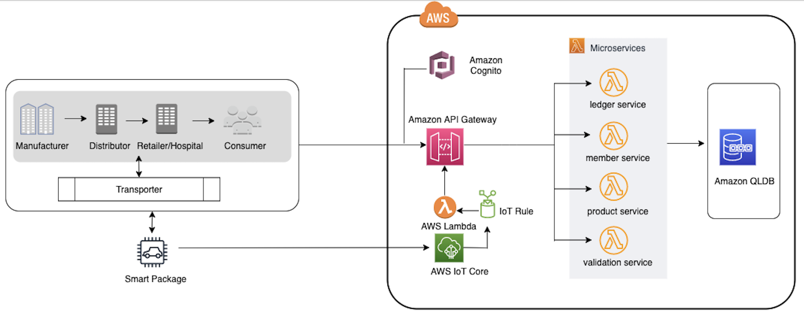

# Build an end-to-end application to track goods in a supply chain using Amazon QLDB

Companies nowadays are increasingly realizing the business value of traceability for efficiency, cost savings, and achieving product lead in the market. However, manufacturing businesses face challenges with the mistrust associated with validating claims of product identity, counterfeiting of products, and traceability.However, companies build complex and custom mechanisms to achieve traceability inside supply chain systems. Instead, you can take advantage of Amazon Quantum Ledger Database (Amazon QLDB) to record the history of each transaction and provide details of every batch manufactured, shipped, stored, and sold from the manufacturing floor to a retail store. As a result, consumers and end-users can validate the authenticity of products and trace product lifecycle events confidently. 

Solution in this repo is a reference source code for a solution to address a key challenge in the pharmaceutical supply chain around tracking and validating the authenticity of manufactured drugs that require strict cold chain storage during the entire supply chain. You can adopt these concepts to implement product traceability into other kinds of sophisticated supply chains as well. Solution in this repo builds a pharmaceutical supply chain network backed by Amazon QLDB as a centralized ledger technology that consists of the following personas:

- Manufacturer - Responsible for manufacturing, labeling and inspecting the quality of the medications
- Distributor – Responsible for shipping the medications to the retailers
- Transporter – Responsible for labeling and transporting the medications from the warehouse to the destination
- Retailer/Hospital – Responsible for labeling and selling medications to the consumer
- Consumer – Receiving the medications

A product (pharmaceutical drug) goes through many different phases as it moves from the manufacturing point to the point of sales. Because multiple parties are involved in the supply chain network, all the involved parties must have direct access to the data and be able to respond to the situation independently.

The different personas have overlapping duties:

- Distributor, Retailer/Hospital, Consumer – Verify whether the pharmaceutical drug being supplied or consumed is circulated only after completing all regulatory compliances
- Transporter, Distributor/Retailer, Hospital, Consumer – Verify whether the pharmaceutical drug cold chain is broken or not
- Consumer, Retailer/Hospital – Verify whether the pharmaceutical drug being supplied or consumed comes from a genuine manufacturing source

The following figure depicts the reference architecture of solution. 
test

## Deployment
Complete the following steps to create the AWS resources mentioned in the architecture. You can take advantage of AWS Cloud9 which is a cloud based integrated development environment to complete below steps or you can run below steps locally on windows or mac workstation/laptop:

1.	Clone the source code from the repo. 
2.	Change the working directory to the cloned repo directory path.
3.	Install & configure AWS CLI, AWS SAM CLI for your environment. Ignore this step if using AWS Cloud9 which comes pre-installed with these tools.
4.	Project root directory has a /lib folder, this folder is used to create shared library layer for solution. Install required dependency modules from the “requirements.txt” using following command-

$ pip install -r requirements.txt -t ./lib/python 

5.	Use AWS Serverless Application Model (AWS SAM) to deploy the solution in your AWS account – 

Step 1 – Validate the template file before deployment

$ sam validate

Step 2 - Build the application

$ sam build

Step 3 - Deploy the application

$ sam deploy –-guided

## Clean up

To avoid incurring future charges, delete the resources by deleting the stack and manually delete the AWS IoT thing. Alternatively, you can delete the AWS CloudFormation stack by running the following AWS SAM command:

$ sam delete

